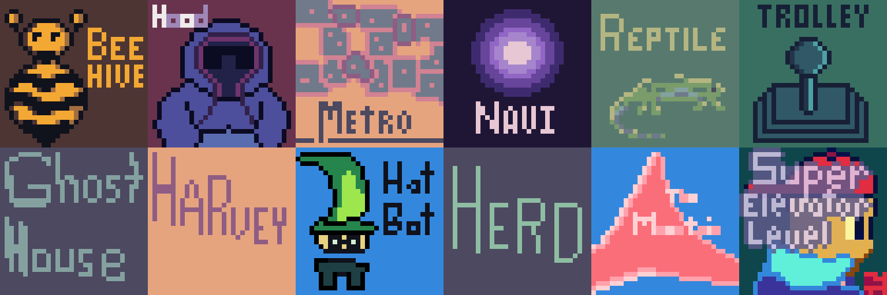

# Dino

  
  
  
 

 
 

Dino _was_ a monorepo started in late 2022 to learning Godot, do game
jams, and start some addons/libraries. Since late 2023, I've been reimagining
and refactoring - the games have being deconstructed and DRYed up into
shared systems.

Dino now presents a suite of short games - these are largely platformer and
top-down games with dungeon crawler and metroidvania-style maps. The
maps are procedurally generated with basic algorithms and some parsed
plaintext - I hope to put together some video devlogs covering the code soon.

I'm currently pushing for a June 1st release [on
steam](https://store.steampowered.com/app/2589550/Dino/)! Wishlist it today, or
just get the [latest on itch.io](https://russmatney.itch.io/dino).

Feel free to ping me [on Discord](https://discord.gg/xZHWtGfAvF) with any
questions or feedback!

### DevLogs

- [Dino Year One DevLog](https://www.youtube.com/watch?v=9cyAnNLGrZI) (Jan 2024)
  - A summary of Dino's first year of development (up to Summer 2023).

### Docs

* [Changelog](/changelog)
* [Games](/games)
* [Systems](/systems)
* [Credits](/credits)
* [(Old) Addons](/old/addons)
* [(Old) Games](/old/games)
* [(Old) BB Godot](/old/bb_godot)

### External Godot Addons

There are some stellar Godot addons out there! Here is a list of those used in Dino:

- [gdUnit4 by MikeSchulze](https://github.com/MikeSchulze/gdUnit4)
- [pandora by bitbrain](https://github.com/bitbrain/pandora)
- [godot_input_helper by nathanhoad](https://github.com/nathanhoad/godot_input_helper)
- [godot_sound_manager by nathanhoad](https://github.com/nathanhoad/godot_sound_manager)
- [gdfxr by timothyqiu](https://github.com/timothyqiu/gdfxr)
- [godot-text_effects by teebarjunk](https://github.com/teebarjunk/godot-text_effects)
- [godot-aseprite-wizard by viniciusgerevini](https://github.com/viniciusgerevini/godot-aseprite-wizard)
- [Metroidvania-System by KoBeWi](https://github.com/KoBeWi/Metroidvania-System)
- [phantom-camera by ramokz](https://github.com/ramokz/phantom-camera)
- [asset-explorer by SirLich](https://github.com/SirLich/asset-explorer)

### Patrons

Many thanks to my patrons! You can support my work here: https://www.patreon.com/russmatney

- Cameron Kingsbury
- Duaa Osman
- Ryan Schmukler
- Alex Chojnacki
- Aspen Smith
- Jake Bartlam
- Ellie Matney

### License / Copyright

Dino © 2022-2024 by Russell Matney

Dino's source code is available via the MIT license - go for it!

(Unless noted elsewhere) ALL other assets (art, sound, music, aseprite files,
etc) are licensed under [CC BY-NC-SA 4.0](https://creativecommons.org/licenses/by-nc-sa/4.0/).
That's ~Attribution Required~, ~Non-Commerical~, ~Share-alike (sticky license)~!

#### Note: Third-party assets in this repo must be purchased to use

Dino uses third-party assets from talented creators that must be purchased before use.

Fonts:

- [Arcade Cabinet by V3X3D](https://v3x3d.itch.io/arcade-cabinet)
- [Enter Input by V3X3D](https://v3x3d.itch.io/enter-input)

These are available (after purchase) under the [CC4 licence](https://creativecommons.org/licenses/by/4.0/legalcode)
